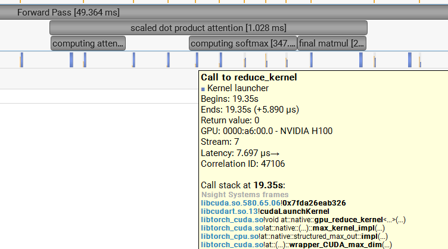
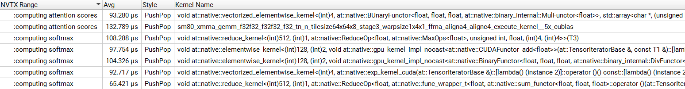

# LLM Benchmarking and Profiling

[← Back to Portfolio](./)

---

## Performance Benchmarking: FP32 vs. BF16 Mixed Precision

### Brief Technique & Impact 
The benchmarks evaluate a modern decoder-only Transformer, spanning five configurations from a "Small" base (12 layers, 768 hidden dimension) up to a 2.7B parameter model. Adopting BF16 mixed precision boosts inference throughput up to 6x and enables training larger, memory-intensive architectures that otherwise fail with full precision due to Out-of-Memory (OOM) constraints.

  
  

### Performance Highlights
The benchmarks demonstrate BF16's superior scalability. In inference, the largest 2.7B model achieves a nearly 600% speedup, jumping from 6.6k to 38.6k tokens/second. The small model (128M parameters) sees throughput nearly triple, reaching over 400k tokens/second. Training benefits are equally critical; while the 128M model trains 2.8x faster with BF16, the technique's true value is unlocking larger architectures. FP32 fails to train the 'large' configuration due to memory limits, whereas BF16 handles it successfully at 24.8k tokens/second, proving essential for resource-constrained high-performance tasks.

### Future Optimizations: Mitigating OOM
To further resolve memory bottlenecks, future work will integrate **Activation Checkpointing** and **Flash Attention**. These techniques significantly reduce memory usage, and updated benchmarks demonstrating their impact are in progress.

---

## Profiling Arithmetic Intensity: MatMul vs. Softmax in Self-Attention

### Theoretical Computational Complexity (FLOPs)
In the Transformer self-attention mechanism, we compare two primary operations: **Matrix Multiplication (MatMul)** for score calculation ($QK^T$) and the **Softmax** normalization layer. Let $S$ represent the sequence length and $D$ represent the head dimension.

* **Matrix Multiplication:** Computing the dot product between matrices of size ($S \times D$) and ($D \times S$) results in an ($S \times S$) output. Each element in the output requires a dot product of length $D$ (involving $D$ multiplications and $D$ additions), totaling approximately $2S^2D$ operations.
* **Softmax:** This operation acts element-wise on the ($S \times S$) attention matrix. It typically involves five operations per element: finding the maximum, subtraction, exponentiation, summation, and division.

### Performance Profiling & Observations
Using **PyTorch NVTX annotations** and the **NVIDIA Nsight Systems** profiler, I isolated these operations during a forward pass in transformer blocks with the configuration $S=128$ and $D=64$.

  
  

| Metric | Matrix Multiplication | Softmax | Ratio (MatMul/Softmax) |
| :--- | :--- | :--- | :--- |
| **Runtime** | 226.06 $\mu s$ | 467.49 $\mu s$ | **~0.48x** |
| **Theoretical FLOPs** | $2S^2D$ | $5S^2$ | **~25.6x** (at $D=64$) |

#### The Efficiency Paradox
The data reveals a striking discrepancy: while MatMul performs **~25.6 times more mathematical work** than Softmax, it completes in **less than half the time**. This paradox highlights the difference between **Compute-Bound** and **Memory-Bound** operations:

1.  **MatMul (Compute-Bound):** Leveraging **cuBLAS** and hardware-level **Tensor Cores (XMMA)**, the GPU performs massive parallel calculations on data already loaded into registers. It exhibits high Arithmetic Intensity.
2.  **Softmax (Memory-Bound):** Because Softmax is implemented as a series of separate CUDA kernels (Reduce, Exp, Add, Div), the GPU must move the ($S \times S$) matrix between VRAM and the cache for every single operation. This constant data movement creates a bottleneck, as memory bandwidth cannot keep up with the processing speed.

### Solution: Fused Kernels
These results demonstrate that "FLOPs" are a poor predictor of actual runtime on modern GPUs. To optimize the Attention layer, one must implement **Fused Kernels**. Fusion allows the GPU to perform all Softmax steps while the data remains in fast Shared Memory, eliminating the costly round-trips to global memory.
