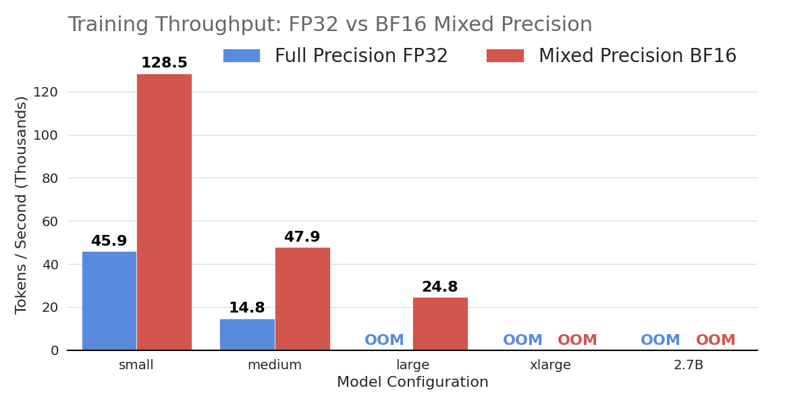
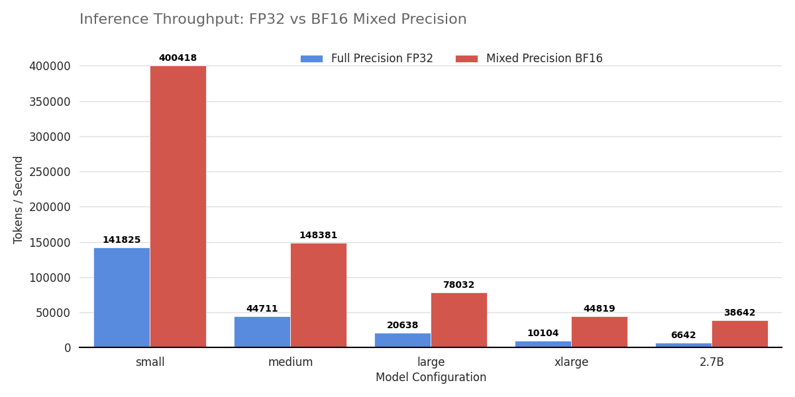

# My AI Portfolio
*Engineering advanced AI systems—from autonomous multi-agent systems and scaling reasoning-focused LLMs on multi-node GPU clusters to performance profiling and distilling DeepSeek R1.*

* [AI Agent](./ai-agent.md)
* [LLM Benchmarking and Profiling](./benchmarking.md)
* [LLM Distillation & Fine-Tuning](./distillation-finetuning.md)
* [Generative AI & Applied Machine Learning](./applied-ml.md)

---

## [AI Agent](./ai-agent.md)

Building intelligent **AI agents** that dynamically reason, retrieve, and self-correct—from Agentic RAG with colocated vLLM inference to tool-augmented reasoning on the GAIA benchmark.

  

**Key projects:**
- **Agentic RAG** — Agent-based retrieval with iterative query refinement, achieving superior accuracy over Standard RAG and standalone LLMs. [Details →](./ai-agent#agentic-retrieval-augmented-generation-rag)
- **Colocated vLLM Inference** — Zero-egress, GPU-cluster deployment with a three-phase hybrid pipeline that collapses latency by an order of magnitude. [Details →](./ai-agent#agentic-rag-with-colocated-vllm-inference)
- **AI Multi-Agent Orchestration** — Hierarchical `smolagents` framework with Langfuse telemetry; achieves **60%** accuracy on GAIA benchmark, outperforming GPT-4's 14.4% baseline. [Details →](./ai-agent#autonomous-multi-agent-orchestration-gaia-benchmark)

[Explore all AI Agent projects →](./ai-agent)

---

## [LLM Benchmarking and Profiling](./benchmarking.md)

Systematic performance analysis of Transformer architectures—benchmarking FP32 vs. BF16 mixed precision and profiling compute- vs. memory-bound operations in self-attention.

  
  

**Key projects:**
- **FP32 vs. BF16 Benchmarking** — BF16 mixed precision delivers up to **6× inference throughput** and unlocks training of larger architectures that fail under FP32. [Details →](./benchmarking#performance-benchmarking-fp32-vs-bf16-mixed-precision)
- **Arithmetic Intensity Profiling** — Reveals why MatMul completes in half the time of Softmax despite **25.6× more FLOPs**, demonstrating the compute-bound vs. memory-bound paradigm. [Details →](./benchmarking#profiling-arithmetic-intensity-matmul-vs-softmax-in-self-attention)

[Explore all Benchmarking projects →](./benchmarking.md)

---

## [LLM Distillation & Fine-Tuning](./distillation-finetuning.md)

Advanced post-training and fine-tuning across large language models—from distilling DeepSeek R1 on multi-node HPC to instruction-tuning Llama 3.

  

**Key projects:**
- **DeepSeek R1 Distillation** — Boosted Qwen2.5-Math-7B accuracy from 13.3% to **56.7%** on AIME 2024 via SFT + GRPO across 8 H100 GPUs. [Details →](./distillation-finetuning#distilling-deepseek-r1-for-enhanced-llm-performance)
- **Llama 3 Sentiment Analysis** — Fine-tuned Llama 3.1–8B achieving **81.49%** accuracy on MTEB tweet sentiment. [Details →](./distillation-finetuning#fine-tuning-llama-3-for-sentiment-analysis)

[Explore all LLM Distillation & Fine-Tuning projects →](./distillation-finetuning.md)

---

## [Generative AI & Applied Machine Learning](./applied-ml.md)

Developing and fine-tuning generative models for image synthesis, as well as applying advanced deep learning architectures to real-world predictive modeling and audio processing tasks.

  
  &nbsp;
   

**Key projects:**
- **Stable Diffusion LoRA** — Fine-tuned SD v2 with LoRA for Naruto-style generation, with **77% training time reduction** via multi-GPU. [Details →](./applied-ml#fine-tuning-stable-diffusion-with-lora)
- **Bike Traffic Prediction** — Graph Attention Networks for urban traffic forecasting; **2nd place** at BTW 2023. [Details →](./applied-ml#predicting-bike-traffic)
- **Speaker Identification** — Transformer/Conformer encoders achieving **91.8%** accuracy. [Details →](./applied-ml#speaker-identification)
- **Anime Face Generator** — Diffusion probabilistic model trained on 71k anime faces. [Details →](./applied-ml#anime-face-generator)

[Explore all Generative AI & Applied Machine Learning projects →](./applied-ml.md)
